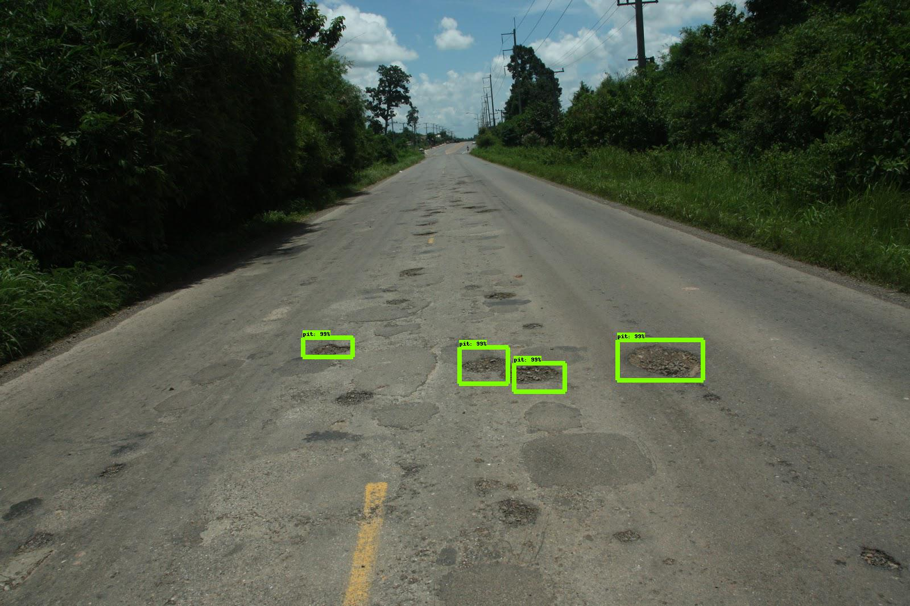

# Serving on localhost

## Install Docker

follow: https://hub.docker.com/

## Get TensorFlow-serving image
Run: `docker pull tensorflow/serving`

Then do the following:

### 1. Run the tensorflow server container:
```bash
# From Traffy_Demo/
docker run -t --rm -p 8501:8501 \
   -v "$(pwd)/data/$faster_rcnn_road:/models/faster_rcnn_road" \
   -e MODEL_NAME=faster_rcnn_road \
   tensorflow/serving &
```

### 2. Run Client_Docker.py, tensorflow-serving client: 
```bash
# Don't forget to activate your python3.6.5 venv

# From Traffy_Demo/
python Client_Docker.py --save_output_image "True" 
```
#Expected Result

 

 
